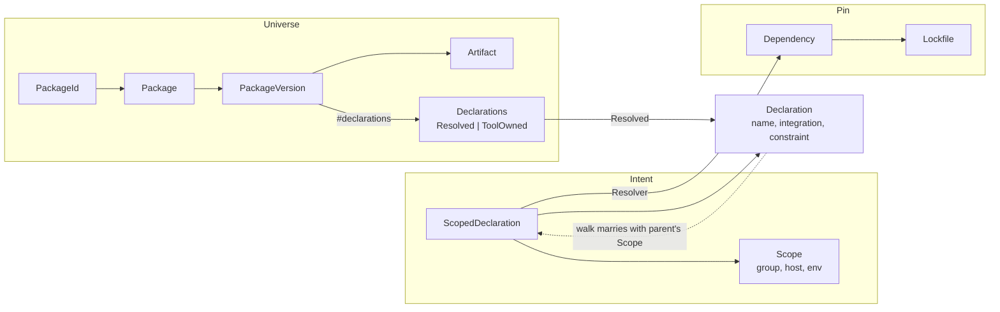
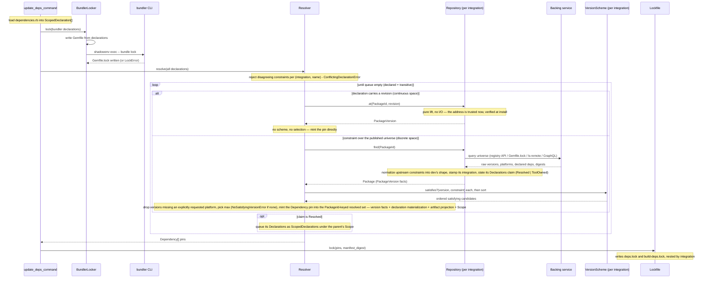
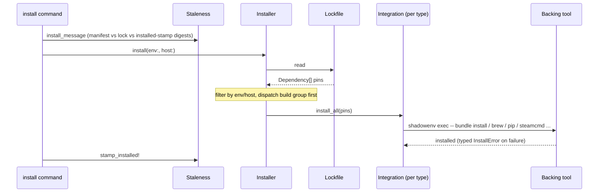

# Dependency architecture

How `dev` turns `dependencies.rb` declarations into installed, pinned,
integrity-checked dependencies. This is the reference the `lib/dev/deps`
code comments point at: the ontology, who owns which decision, how
integrity works per ecosystem, and what to build when adding a new one.

## Ontology

Five ideas, kept strictly apart. Each has one class, and no class plays
two roles.

| Concept | Class | What it is |
| --- | --- | --- |
| Identity | `PackageId` | Which package: `integration` + `name`, plus `source` for source-addressed deps (a git URL, an `owner/repo` slug, a tap, a Steam app id). Value object, works as a Hash key. Version is deliberately not identity: two versions of one package are related candidates in one universe, never two packages — keeping selection (semver, ranges) possible over them. If a legitimate same-package-twice case ever appears, the fix is per-context resolution in the solver, not versioned identity. |
| Universe | `Package` → `PackageVersion` | What exists: every version a repository reports, each carrying facts — `platforms`, `digest`, `artifacts` (dev-fetched bytes), `declarations` (its declared-deps claim), and `metadata` (ecosystem facts). Facts are unconditional: nothing in a universe depends on who asked. |
| Declaration | `Declaration` | The shared atom: name + integration + constraint + optional `source` coordinate + optional `revision` address, always in dev's shape (`{}` = unconstrained). A constraint is a predicate over the published universe; a revision is a direct address into an ecosystem's continuous space (a git commit SHA, an exact Xcode version) that forgoes resolution entirely — declaring both is a loud error. Stated by whoever authored the thing — a project's `dependencies.rb` row or an upstream manifest — and context-free by type: where/when *you* install is not part of what is declared about a package. |
| Requirement | `ScopedDeclaration` | A `Declaration` married to the context it resolves under: a `Scope` (`group`, `host`, `env` — inherited down the walk as one unit) plus the per-row axes that deliberately don't inherit (`platform`, `post_install`, `materialization` — install instructions like `install_dir`, asset globs, build recipes, artifact targets). What the DSL produces and the Resolver consumes. Composition, not a subclass: a scoped declaration must never pass where a context-free `Declaration` is expected. |
| Pin | `Dependency` | What was chosen: exact version, integrity hash, metadata. What the lockfile serializes and integrations install. |

Supporting types: `Artifact` (one downloadable file with an optional
published digest), `Scope` (the walk-inherited context, projected onto
pins as host/env metadata), and `Declarations` — a sealed sum type for a
version's declared-deps claim: `Resolved([Declaration…])` (facts dev can
walk; `Resolved([])` affirmatively requires nothing) or `ToolOwned` (the
ecosystem's tool owns a closure dev never sees). A bare array could not
keep those last two apart.

## Layers and their one question

| Layer | Class(es) | The one question it answers | Never does |
| --- | --- | --- | --- |
| Repository | `Repository#find(id) -> Package`, `Repository#at(id, revision) -> PackageVersion` | "What published versions of this package exist, and what are their facts?" (`find`) / "Lift this address into a version" (`at`) | Evaluate constraints; choose among candidates; see install instructions |
| Scheme | `VersionScheme#satisfies?/#sort` | "Does this version satisfy this constraint, and how do versions order?" | Talk to the network; know about declarations |
| Locker | `Locker#lock(declarations)` | "Given this whole declaration set, make the ecosystem tool solve it" | Read the result (that's the repository's find) |
| Resolver | `Resolver#resolve(declarations) -> [Dependency]` | "Which version do we pin, and what transitives follow?" | Fetch bytes; know ecosystem constraint syntax |
| Integration | `Integration#install_all` | "How do these pins become installed software on this machine?" | Resolve versions |

The registry (`Registry::INTEGRATIONS`) is the single wiring table: one
`Entry` per integration symbol declaring its repository, optional scheme
(nil for integrations with no constraint grammar — url, xcode), optional
locker, optional integration, optional `install_alias` (url installs
through cmake's integration *instance*, so their shared batch artifact
`deps.cmake` is written once, whole), and scope. Consistency tests fail
the build if a `*_repository.rb`, `*_integration.rb`, `*_scheme.rb`, or
`*_locker.rb` class exists without a registry entry.

## Discrete and continuous: the two repository operations

Every ecosystem's version space splits in two, and each half gets its own
operation:

- **Discrete** — the published universe: gh releases and tags, git refs,
  brew formula-spec families, steam branch tips, pip releases.
  Enumerable, so `find(id)` reports all of it with facts, and constraints
  select over it. `find` is the I/O operation; for degenerate universes
  the query *is* the observation — url downloads and hashes the artifact
  (an observable-now singleton), cask checks nothing because the name's
  presence is the whole fact.
- **Continuous** — the space between published versions: any reachable
  git commit SHA, any exact Xcode version. Never enumerated — no query
  lists reachable SHAs at any cost. A declaration addresses it with a
  `revision`, and `at(id, revision)` lifts that address into a
  `PackageVersion` — **pure, no I/O, ever**. The address is trusted at
  resolve time and dereferenced/verified at install, the same
  pin-as-assertion semantics a steam `buildid:` has. No scheme runs over
  the result and no selection happens: by pinning a revision the author
  foreran resolution (and with it, any future diamond-dependency
  reconciliation — a revision is exact by definition).

Overriding `at` *is* the declaration that an integration has a continuous
space (cmake/git commits, xcode versions); the base class refuses with
`NoAddressableSpaceError` and the Resolver lets that refusal propagate.
There is no registry flag to drift out of sync.

Revisions are deliberately *not* standardized the way constraints are: a
constraint is a predicate dev must evaluate, so it must be in dev's shape;
a revision is an opaque address dev only forwards, spelled in the
ecosystem's canonical form and validated at the DSL boundary (a cmake
`commit:` must be a full 40-hex SHA).

## The resolve pipeline

`dev update-deps` runs:

1. **Lock** — for each integration with a registered `Locker`, run it over
   that integration's declarations. Today that is bundler only:
   `BundlerLocker` writes the Gemfile and runs `bundle lock`, producing
   `Gemfile.lock`. After this step, tool-solved universes are materialized
   on disk.
2. **Resolve** — the `Resolver`, per declaration:
   - rejects declaration sets where one package (integration + name)
     carries disagreeing constraints, sources, revisions, or
     materializations (axes — group/platform/host/env — may differ; the
     same name under two integrations is two packages, free to differ);
   - if the declaration carries a `revision`, dispatches to
     `at(id, revision)` and mints the pin from the lifted version
     directly — no universe query, no scheme, no selection (the author
     foreran resolution); integrations without a continuous space refuse
     loudly (`NoAddressableSpaceError`);
   - otherwise builds the `PackageId` (the declaration's `source` rides
     the id) and calls `find(id)` — identity in, universe out; nothing
     version-shaped crosses this seam;
   - filters the reported versions through the integration's scheme
     (`satisfies?`, fact-aware: schemes may match universe facts like a
     steam branch or a git ref), treating scheme-unparseable universe
     versions as non-candidates, and drops versions that don't publish
     every explicitly requested platform; scheme-less integrations (url,
     xcode) accept only the empty constraint — anything else is a loud
     `UnknownIntegrationError`, never a silent pass;
   - picks the highest satisfying version (`sort`), mints the
     `Dependency` from that version's facts merged with the declaration's
     `materialization` (install instructions meet version facts exactly
     here — a url dep's `version_label` is promoted into the pin's
     version slot when the universe reports none), projects the declared
     platforms/target against the version's artifacts (the per-platform
     `platforms` block or single-target digest), and projects the
     declaration's `Scope` onto the pin's metadata (host/env keys,
     present only when pinned);
   - cases on the chosen version's `declarations` claim: a `Resolved`
     claim's declarations are queued as synthetic `ScopedDeclaration`s
     inheriting the parent's `Scope` as one unit (each already carries
     the integration its repository stamped — the resolved set is keyed
     by `PackageId`); a `ToolOwned` claim has nothing to walk.
3. **Write** — pins go to `deps.lock` (app/test groups) and
   `build-deps.lock` (build group), nested by integration
   (`brew:` → `zlib:` → attrs) so the on-disk key carries the same
   (integration, name) identity the resolver keys on. The reader also
   accepts the pre-nesting flat format; that shim is deleted once every
   consumer repo's lockfiles have been rewritten by `update-deps`.

`dev install-deps` reads the lockfile and hands each integration its pins;
no resolution happens at install time.

### Resolution flow (`dev update-deps`)

### Install flow (`dev install-deps`)

The repositories never appear in the install flow: pins are read from the
lockfiles, and each Integration drives its backing tool. The Locker never
appears inside the resolution loop: it runs once, before, sequenced by the
command.

## Constraint semantics per integration

| Integration | Scheme | Constraint language |
| --- | --- | --- |
| bundler | `GemScheme` | rubygems requirements (`~>`, `>=`, …) — but selection is degenerate: the universe is the lock's singleton choice |
| ficsit | `SemverScheme` | node-style ranges (`^`, `~`, comparators) |
| pip | `Pep440Scheme` | PEP 440 specifiers (`==`, `~=`, wildcards, conjunction) |
| luarocks | `RockScheme` | rockspec-style comparators and `~>` |
| gh | `ExactScheme(key: "tag")` | the constraint names one release tag out of the enumerated releases+tags universe; no range grammar exists by design. Unconstrained selects the latest release. |
| cmake | `GitScheme` | `tag:`/`branch:` match the version's `ref` fact over the enumerated `ls-remote` refs. `commit:` is not a constraint at all — it is a revision (continuous space, `at`). |
| steam | `SteamScheme` | `branch:` selects by the version's branch fact (default `public`); optional `buildid:` is an exact assertion that fails loudly when it is no longer the branch tip. |
| brew, cask | `BrewScheme` | `version:` is a formula *suffix* (`"18"` selects the `llvm@18` sibling out of the enumerated spec family), matched against the `version_suffix` fact; the reported stable version is brew's record, not the coordinate. Casks have no suffix fact — versioned casks are distinct cask names (`temurin@21`), so `version:` on a cask is unsatisfiable by construction. |
| url, xcode | — (no scheme) | no constraint grammar exists: url's universe is an observable-now singleton, xcode is revision-addressed. Only the empty constraint is legal; anything else raises. A url `tag:` is a display label riding materialization, naming, never selection. |

**The constraint standard is a shape plus an interpreter, never a
grammar.** Every constraint in the system is a dev-shaped hash whose keys
the integration's `VersionScheme` owns (`{ "version" => "^3.6" }`,
`{ "tag" => "v1.0" }`, `{}` = unconstrained); repositories mint that shape
at the `find` seam, normalizing whatever syntax the upstream manifest used
— constraints cross the system boundary exactly once. A universal
constraint grammar across semver/PEP 440/buildids would be a lie, so
cross-ecosystem capability grows by widening the scheme algebra (a future
`intersect`), never by translating vocabularies. Dev-native territory
(no upstream scheme to inherit) defaults to SemVer via `SemverScheme`.

Scheme parse failures split by whose fault they are:
`VersionScheme::InvalidConstraintError` (the user's declaration is wrong —
propagates) vs `VersionScheme::InvalidVersionError` (the universe contains
a version that ignores the ecosystem's conventions — the Resolver skips
that candidate).

## Integrity regimes

Who guarantees the bytes you install are the bytes that were resolved:

- **dev-enforced** — the repository reports a digest fact, the pin carries
  it, and the integration (or `Cache`) verifies downloaded bytes against
  it. ficsit (per-target SHA256 from the API), url (trust-on-first-use:
  download at resolve time, hash, pin), pip (sdist SHA256 from PyPI's
  JSON API), bundler (`Gemfile.lock` CHECKSUMS, verified by
  `bundle install --frozen`).
- **tool-enforced** — the ecosystem tool verifies integrity itself at
  install; dev records what it can for audit but doesn't gate on it.
  brew (bottle SHA256s are brew's own check), gh (release assets carry
  API digests; `gh` downloads), steam (Steam's own depot verification),
  luarocks (rockspec digests checked by luarocks).
- **identity-as-integrity** — git SHAs: pinning the 40-char commit *is*
  the integrity statement; there is no separate digest.

A nil `PackageVersion#digest` means exactly "upstream publishes none" —
never "we didn't bother".

## Transitive-dependency regimes

Who owns an installed package's transitive closure. The claim travels
*with the data*: each repository constructs the `Declarations` variant its
regime warrants, so construction is the dispatch — there is no registry
attribute, repository enum, or resolver guard to drift out of sync.

| Regime | Integrations | Claim | How transitives happen |
| --- | --- | --- | --- |
| dev-resolved | ficsit | `Resolved(declarations)` | The resolver walks the declarations, inheriting the parent's `Scope`; every transitive becomes its own pin. |
| tool-locked | bundler | `ToolOwned` | `BundlerLocker` makes the tool solve the whole set up front (`bundle lock`); the repository reads pinned versions back. |
| tool-at-install | pip, luarocks, brew | `ToolOwned` | The tool resolves the closure when it installs; dev pins top-level packages only. |
| self-contained | steam, git, xcode, url — and gh | `Resolved([])` | Nothing to resolve: the artifact carries everything it needs. steam/git/xcode/url guarantee it by construction; gh's is a usage contract (prebuilt assets are baked; a source build's needs are declared by the consuming project) until subproject resolution lands. |

Two standing decisions:

- **Lock files are never availability facts.** A repository answers "what
  exists now"; an integration's lock file is a past solve's snapshot, so
  its graph is never mined for `Resolved` declarations.
  `BundlerRepository#find` reading `Gemfile.lock` is consistent with this:
  the Locker regenerates that file in step 1 of the same run, and even
  then only pinned versions are read — bundler stays `ToolOwned`.
- **`Resolved([])` and `ToolOwned` are different claims.** "This version
  affirmatively requires nothing" and "the tool owns a closure dev can't
  see" used to collapse into the same empty array; the sum type keeps a
  future solver from walking a universe that was never observable.

## Adding a new ecosystem

1. **Repository** — subclass `Repository`, implement `find(id) ->
   Package`. Report facts for every published version — enumerate the
   whole discrete universe; identity is the only input. If the ecosystem
   also has a continuous space (addressable revisions between published
   versions, like git SHAs), override `at(id, revision)` as a *pure* lift
   — no I/O; the address is verified at install. Facts are unconditional
   — never read install instructions, which don't reach this seam. State
   your transitive regime by construction: build the `Declarations`
   variant your ecosystem warrants, normalizing upstream constraint
   syntax into dev's shape as you do (no upstream scheme means SemVer).
   Raise a subclass of `Repository::PackageNotFoundError` when the
   identity doesn't exist. Never pick a version.
2. **Scheme** — subclass `VersionScheme` with your ecosystem's
   `satisfies?`/`sort`, nesting
   `InvalidConstraintError`/`InvalidVersionError` under the shared bases.
   If the constraint names one exact coordinate, `ExactScheme(key:)`
   probably already covers you. Every ecosystem with a constraint grammar
   states its real semantics — there is no satisfies-everything scheme; an
   ecosystem with *no* grammar registers `scheme: nil` and only the empty
   constraint is legal against it.
3. **Locker** — only if the ecosystem's own tool must own the whole-set
   solve (transitive co-resolution you can't reproduce): subclass
   `Locker`, make the tool materialize its lock, and have the repository
   `find` read it.
4. **Integration** — subclass `Integration` to install pins.
5. **Registry** — add the `Entry`. The consistency tests will hold you to
   it.
6. **DSL** — add the declaration verb in `dsl.rb`, and its symbol to the
   consistency test's `DECLARATION_INTEGRATIONS`.

## Decision gate: who owns the solve

Two models for whole-set dependency resolution:

- **A. dev-owned** — dev enumerates universes (`find`), evaluates
  constraints (schemes), and picks versions, including joint constraint
  satisfaction across the graph. Full control; enables cross-project
  resolution of another repo's `dependencies.rb`; requires implementing
  real dependency solving per ecosystem.
- **B. tool-owned** — the ecosystem tool solves (bundle lock / pip /
  luarocks at install), and dev records its answer.

**Current stance: per-ecosystem hybrid, leaning A.** The interfaces are
Model A's — `find` + schemes + Resolver choice — and ficsit already
resolves fully dev-owned (universe, ranges, transitives). bundler stays
tool-owned behind `BundlerLocker` because reproducing Bundler's joint
solve is high cost for zero behavioral gain. pip and luarocks currently
pin top-level packages dev-owned and let the tool resolve transitives at
install, same fidelity as before.

Revisit (the gate): if we need cross-ecosystem joint solving, offline
resolution of a foreign project, or reproducible pip/luarocks transitive
pins, the missing piece is per-ecosystem *declared-deps facts* (a
`Resolved` claim in `find`) plus a backtracking solver in the Resolver —
the interfaces already accommodate both (`PackageVersion#declarations` is
the slot). No interface change is expected; the cost is per-ecosystem
declaration enumeration and solver work, so pay it per ecosystem when the
need is real, not up front.
